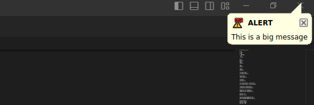

<center>

</center>
<br>

# sysnotify Qt Desktop Notify

A program to display notifications in Linux.

## **📌 Usage**
```sh
sysnotify [options]
```

Qt System Tray Notification

### **Options**
| Option | Description |
|--------|-------------|
| `-h, --help` | Displays help on command line options. |
| `--help-all` | Displays help, including generic Qt options. |
| `-v, --version` | Displays version information. |
| `-t, --title <string>` | Notification title. |
| `-m, --message <string>` | Notification message. |
| `-p, --priority <low|normal|high>` | Notification priority (low, normal, high). |
| `-c, --category <system|critical|network>` | Notification category (system, critical, network). |
| `-d, --delay <ms>` | Notification delay in milliseconds. |
| `-i, --icons` | List available icons in the embedded resources. |

---

## **📌 Example Usage**
### ✅ **List All Embedded Icons**
```sh
sysnotify --icons
```

### ✅ **Send a System Notification**
```sh
sysnotify --title "System Update" --message "A new update is available!" --category system --delay 4000
```

### ✅ **Send a Critical Notification**
```sh
sysnotify --title "Disk Full!" --message "You are running out of disk space!" --category critical --priority high
```

### ✅ **Send a Network Notification**
```sh
sysnotify --title "WiFi Connected" --message "You are now connected to HomeWiFi" --category network
```

<center>

</center>
<br>

---

## **📌 Project Structure**
```sh
qt-desktop-notify
├── CMakeLists.txt
├── notify.pro
├── src
│   ├── main.cpp
└── bin  (binary output)
```

---

## **📌 Build Instructions - Command Line**

### Release

```sh
cd qt-desktop-notify
./scripts/build.sh
```

### Debug

```sh
cd qt-desktop-notify
./scripts/build.sh debug
```

## **📌 Build Instructions - VSCODE**

### Use the tasks Build_Debug / Build_Release


1. Click Terminal
2. Run Task 
3. Build_Release / Build_Debug


<center>

</center>
<br>

## **📌 You can Add Keyboard Shortcuts to build in VSCODE

1. Click File
2. Run Preferences 
3. Keyboard Shortcuts **OR** CTRL+K, CTRL+S

<center>

</center>
<br>

4. Click on the Edt JSON button 

<center>

</center>
<br>

5. Add your shortcut 

```json
    {
        "key": "ctrl+shift+w",
        "command": "workbench.action.tasks.runTask",
        "args": "Build_Release"
    },    
```

## Automatic Version Update

There's a script named ```scripts/update_version.sh``` that is called when you build. It will generate the file **version.cpp** with the latest version.

The version is updated everytime you build to keep track of changes, I find this usefull when you want to make sure you ee wa really updated.


<center>

</center>
<br>

<center>

</center>
<br>

### Getting the Binary Version

Use the ```-v``` option

<center>

</center>
<br>

#### Note that in Release, the Version is always based on the last tag

<center>

</center>
<br>


Run the program:
```sh
sysnotify --title "Alert Notification" --message "Hello, this is an alert!"
```


## **📌 Installing the Binary**
After compiling, install the binary system-wide:
```sh
sudo make install
```
This will copy the binary to `/usr/bin/notify`, so you can run it from anywhere:
```sh
notify --title "Test" --message "This is a notification!"
```

---

## **📌 Troubleshooting & Fixes**
### **1️⃣ Check if Your Desktop Environment Supports System Tray**
Some minimal Linux desktop environments (like i3, Sway, Openbox, Wayland-based desktops) may not have a system tray by default.

Try running:
```sh
qdbus org.kde.StatusNotifierWatcher /StatusNotifierWatcher StatusNotifierItems
```
or
```sh
dbus-send --print-reply --dest=org.freedesktop.DBus / org.freedesktop.DBus.ListNames
```
If there is no system tray service running, Qt notifications won't work.

### **2️⃣ Enable a System Tray Service**
If your environment does not have `org.kde.StatusNotifierWatcher`, you can try running a system tray manually.

#### **For GNOME Users (Install AppIndicator Extension)**
```sh
sudo apt install gnome-shell-extension-appindicator
gnome-extensions enable appindicatorsupport@rgcjonas.gmail.com
```
Then **restart GNOME** (log out and log in).

#### **For XFCE / i3 / Openbox Users (Use `stalonetray` or `trayer`)**
```sh
sudo apt install trayer
trayer --edge top --align right --SetDockType true --expand true
```

#### **For KDE Users (Ensure Plasma's System Tray is Enabled)**
```sh
kquitapp5 plasmashell && kstart5 plasmashell
```

---

## **📌 Testing All Notification Categories**
This script tests every notification category:
```sh
notify --title "System Alert" --message "System check completed" --category system && \
notify --title "System Alert 64" --message "Running on 64-bit system" --category system64 && \
notify --title "Alert" --message "Important system alert!" --category alert && \
notify --title "Critical Warning" --message "Flammable substance detected!" --category critical && \
notify --title "Radiation Alert" --message "Non-ionizing radiation detected!" --category radiation && \
notify --title "Notification" --message "You have a new notification!" --category notify && \
notify --title "Package Delivered" --message "Your package has been delivered!" --category delivery && \
notify --title "Plex Media" --message "Plex media server is running!" --category plex && \
notify --title "Warning Sign" --message "Check the system warnings!" --category sign && \
notify --title "System Tray" --message "This is a systray test!" --category systray && \
notify --title "Urgent Alert" --message "Immediate attention required!" --category urgent && \
notify --title "Secure Vault" --message "Vault access granted!" --category vault && \
notify --title "VPN Connected" --message "Your VPN is active!" --category vpn && \
notify --title "General Warning" --message "System warning issued!" --category warning && \
notify --title "Warning Type 1" --message "System warning type 1 detected!" --category warning1 && \
notify --title "Warning Type 2" --message "System warning type 2 detected!" --category warning2 && \
notify --title "Web Alert" --message "New activity detected online!" --category web && \
notify --title "Network Alert" --message "You are now connected to the network!" --category network && \
notify --title "Network Alternative" --message "Secondary network detected!" --category network2 && \
notify --title "YouTube Notification" --message "New video uploaded!" --category youtube && \
notify --title "YouTube 64" --message "HD video ready to stream!" --category youtube64
```
